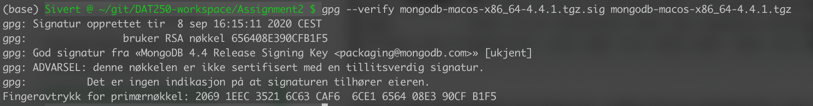
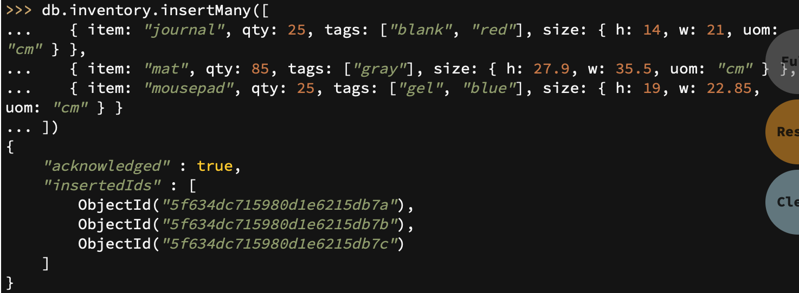
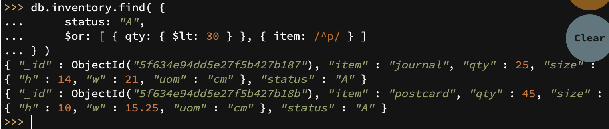
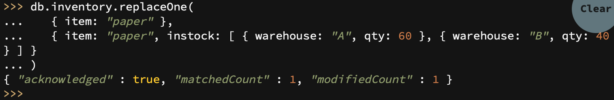
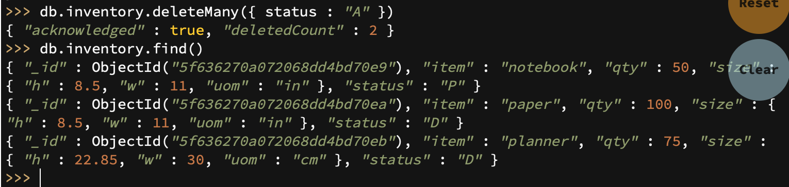
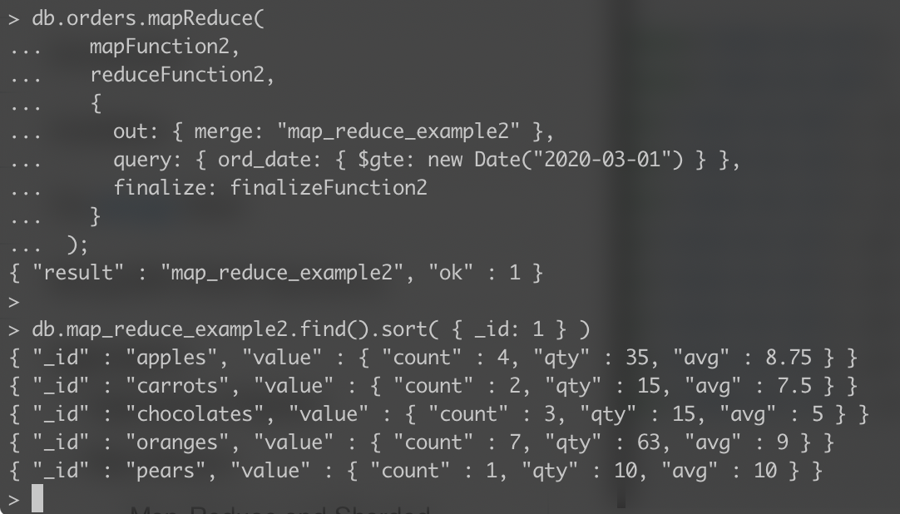
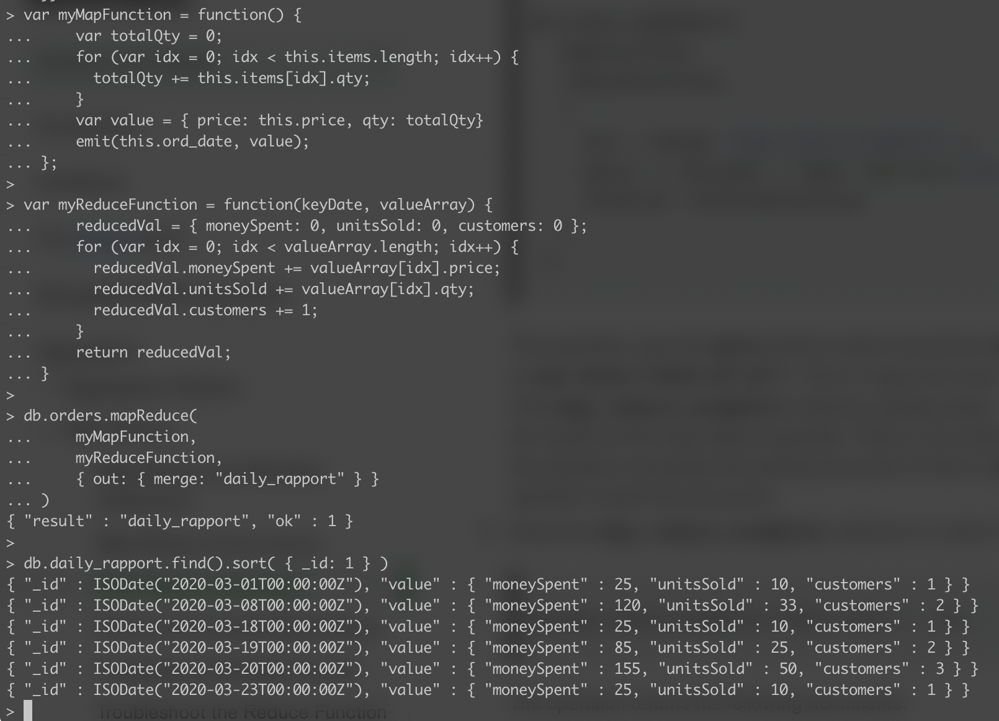

# Assignment 3 #

## Installation & set-up ##
The installation was a bit confusing as the various links given in the assignment referenced several different ways of downloading MongoDB. I initially used homebrew to download it, but noticed that the guide for verifying the download didn't reference homebrew, but rather curl for downloading and then gpg for verifying. I therefore re-downloaded it with curl and also had to download gnupg in order to use the gpg command. 

## Experiment 1 CRUD ##
This entire experiment was very straight forward as there was really no room for error. It consisted of copying the commands and watching the results of the executions. I did this experiment in the web shell.

### Create ###

### Read ###

### Update ###

### Delete ###

## Experiment 2 ##
As with experiment 1, there was little room for error on the first part of this second experiment. I spent some time understanding what each function and step was doing, and then it was just a matter of copying and executing. I did this in my own MongoDB. I started the database by running the command "brew services start mongodb-community@4.4" and then opening another terminal window where I connected to the instance by running the command "mongo".

### Example tutorial execution ###

### My own operation ###
I decided to create a mapping of each day and some stats for that day. I thought this would be useful in analyzing shopping patterns or to simply get an overview of the day's occurences. I used atom to write the functions as I found it difficult to write them directly in the terminal interface. 

**Map function**
I started by mapping dates to arrays containing price and totalQty for a particular shopping trip.

~~~~
var myMapFunction = function() {
    var totalQty = 0;
    for (var idx = 0; idx < this.items.length; idx++) {
      totalQty += this.items[idx].qty;
    }
    var value = { price: this.price, qty: totalQty}
    emit(this.ord_date, value);
};
~~~~

**Reduce function**
I then reduced these arrays down to a single array for each day, and added a field for amount of customers.

~~~~
var myReduceFunction = function(keyDate, valueArray) {
    reducedVal = { moneySpent: 0, unitsSold: 0, customers: 0 };
    for (var idx = 0; idx < valueArray.length; idx++) {
      reducedVal.moneySpent += valueArray[idx].price;
      reducedVal.unitsSold += valueArray[idx].qty;
      reducedVal.customers += 1;
    }
    return reducedVal;
}
~~~~

**Execution**
Finally I executed the mapReduce function by exporting the documents to a new collection "daily_rapport"

~~~~
db.orders.mapReduce(
    myMapFunction,
    myReduceFunction,
    { out: { merge: "daily_rapport" } }
)
~~~~

**Full execution:**

